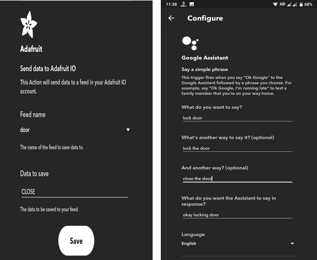

# Open door from remote location

In this project,we have developed smart door lock, which allows to lock/unlock door from remote location using your smartphone.

### Prerequisites

1. NodeMCU
2. ServoMotor
3. Adafruit IO Account
4. IFTTT App
5. Install following libraries in Arduino IDE from GitHub
   * ESP8266WiFi
   * Adafruit_MQTT_Library  
6. Android App


### Installing

DownLoad our source code from [here](code.ino).

Replace following with your Wi-Fi name and password
```
  #define WLAN_SSID  "Wi-Fi name"
  #define WLAN_PASS  "Wi-Fi password"
```

Replace following with your Adafruit IO credential
```
  #define AIO_USERNAME "Adafruit IO id"
  #define AIO_KEY      "Adafruit IO key"
```
Now Upload this Code on NodeMCU using Arduino IDE. If everything will be fine,then you can see "MQTT Connected!" on serial monitor.

Now Setup IFTTT applet using following settings.



You can do same for unlocking the door.


